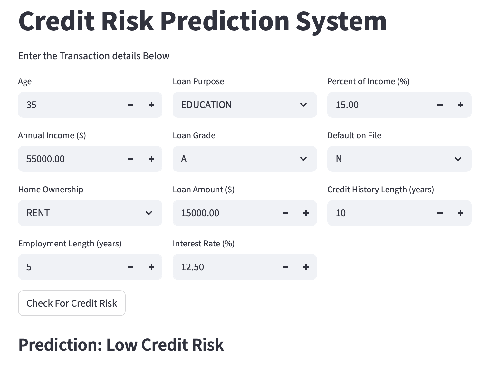
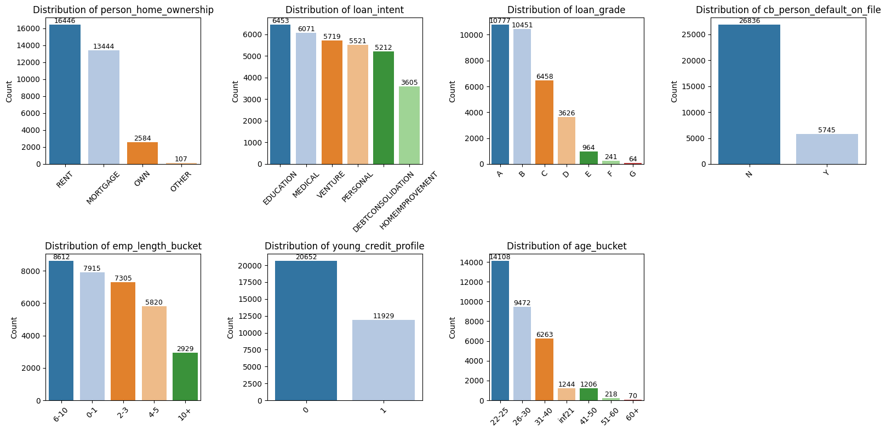
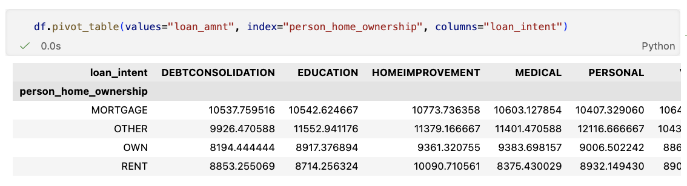
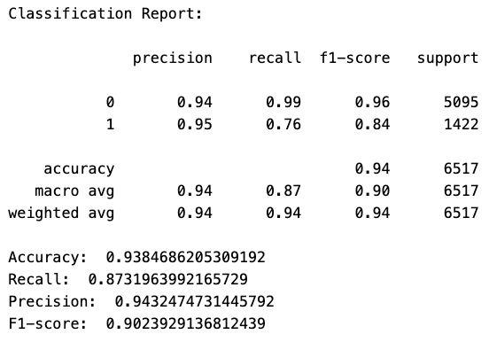
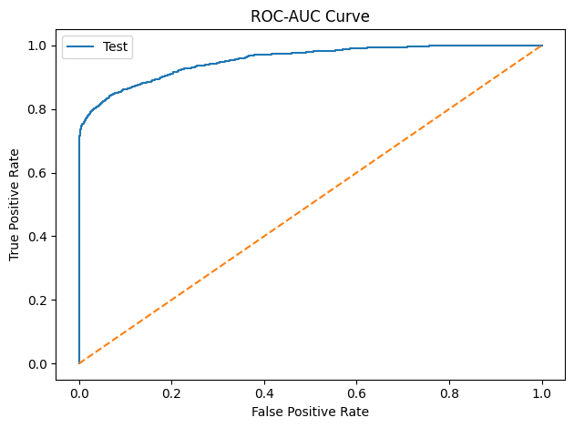
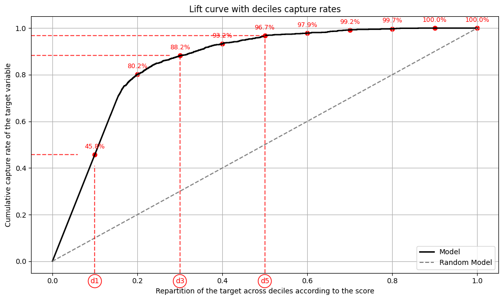
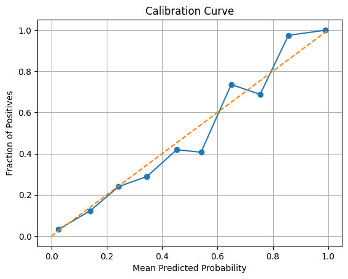
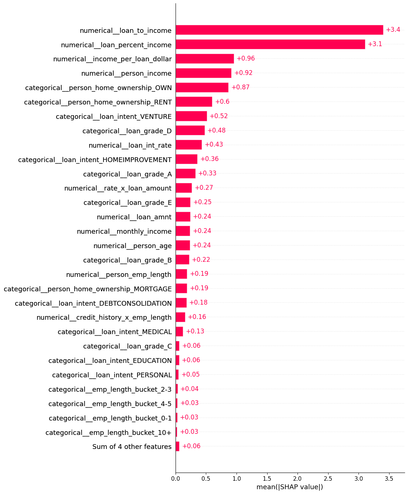
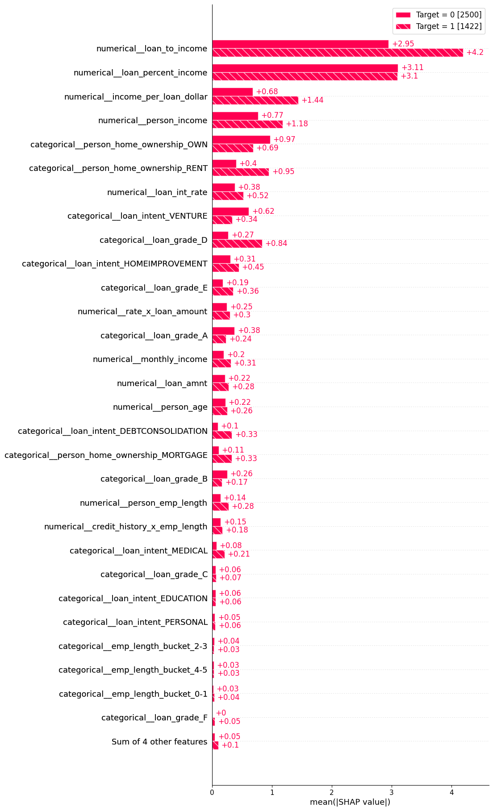
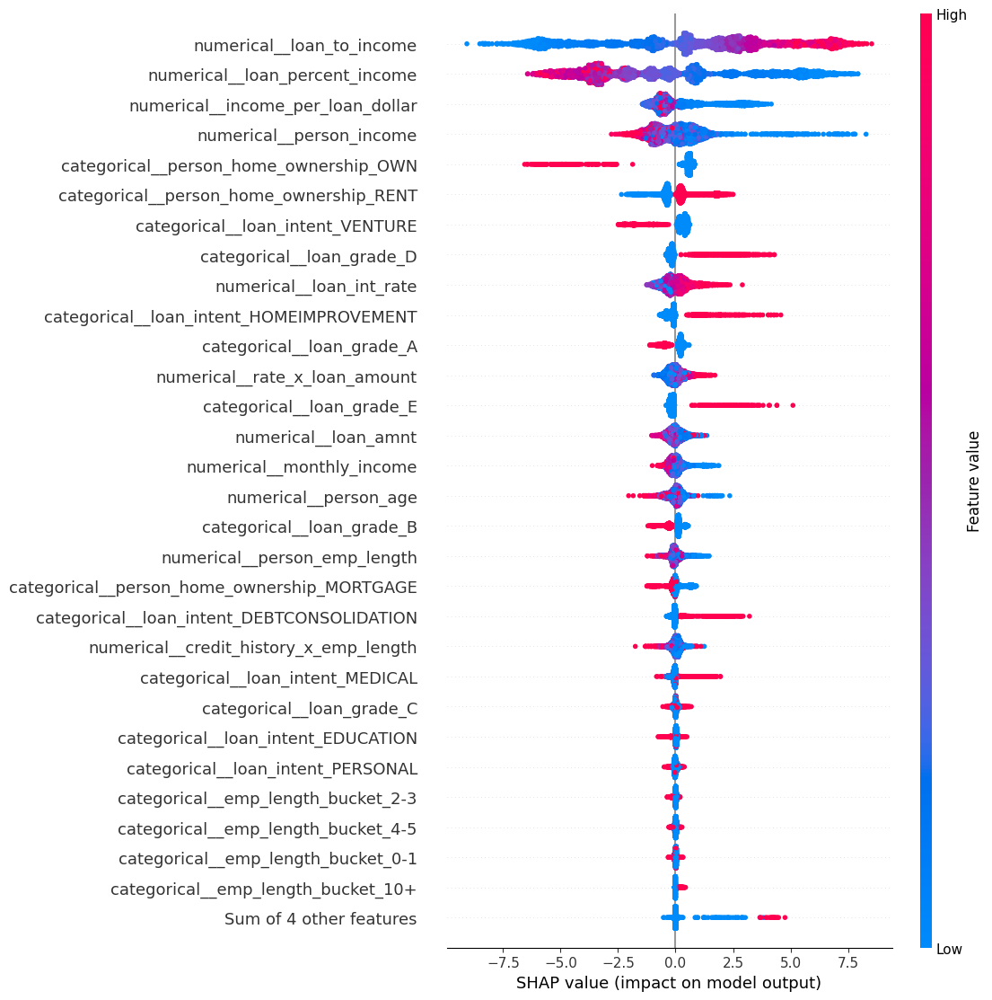

# Credit Risk & Fraud Prediction
> End-to-end machine learning pipelines for **credit risk assessment** and **payment fraud detection**, covering data preprocessing, feature engineering, imbalanced-learning, hyperparameter optimization, model evaluation, SHAP-based explainability, and interactive Streamlit deployment.
>
> * **Credit Risk Assessment:** **93.7% accuracy**, **0.91 PR-AUC**, **maintaining performance while reducing the feature space by 44%** through feature selection
> * **Payment Fraud Detection:** **99.78% accuracy**  


# Table of Contents
* [Path tree](#path-tree)
* [Project Overview](#project-overview)
* [Repository Structure](#repository-structure)
* [Installation](#installation)
* [Running the Applications](#running-the-applications)
* [Application Previews](#application-previews)
* [Machine Learning Pipeline](#machine-learning-pipeline)

  * [1. Data Preparation](#1-data-preparation)
  * [2. Preprocessing & Feature Engineering](#2-preprocessing--feature-engineering)
  * [3. Model Selection & Hyperparameter Optimization](#3-model-selection--hyperparameter-optimization)
  * [4. SHAP-Based Feature Selection](#4-shap-based-feature-selection)
  * [5. Model Evaluation](#5-model-evaluation)
  * [6. Model Saving & Deployment](#6-model-saving--deployment)
* [Legacy Pipeline](#legacy-pipeline)


# Project Overview
This project contains three end-to-end machine learning applications:
* **Credit Risk** — predicts whether a loan is likely to be high risk.
* **Modern Credit Risk** — an improved version using cross-validation, multiple candidate models, Optuna optimization, and SHAP-based feature selection.
* **Payment Fraud Detection** — identifies potentially fraudulent payment transactions.

The project focuses on a complete production-oriented workflow:

```text
Raw Data
    │
    ▼
Feature Engineering
    │
    ▼
Train / Test Split
    │
    ├────────────────────---------------------──────────┐
    │                                                   │
    ▼                                                   ▼
Cross-Validation +                                  Test Set
Optuna Hyperparameter Search                       (untouched) 
    │                           
    ▼
Preprocessing Pipeline
    │  ┌───────────────┐           
    │  │ imputer       │           
    │  │ encoder       │           
    │  │ scaler        │           
    │  │ SMOTE         │           
    │  │ model         │           
    │  └───────────────┘     
    │   
    ▼   
Model Training +
Evaluation on Validation Folds
    │
    ▼
Best Model + Parameters
    │
    ▼
Cross-Validated SHAP
    │
    ▼
Feature Selection
    │
    ▼
Retrain on Reduced Feature Set
    │
    ▼
Final Evaluation on Test Set
    │
    ▼
Joblib Model + Streamlit App
```
The test set remains completely untouched during model selection and feature selection and is used only for final evaluation.


# Repository Structure
```text
Credit_Risk_and_Fraud_Prediction/
│
├── data/
│   ├── datasets/
│   │   ├── credit_risk/
│   │   └── fraud_detection/
│   │
│   ├── credit_risk_model/
│   ├── modern_credit_risk_model/
│   ├── fraud_detection_model/
│   └── pictures/
│
├── credit_risk.ipynb
├── modern_credit_risk.ipynb
├── paiement_fraud.ipynb
│
├── credit_risk_app.py
├── modern_credit_risk_app.py
├── paiement_fraud_app.py
│
├── requirements.txt
└── README.md
```
* `data/datasets/`: source datasets
* `data/*_model/`: trained models and associated metadata
* `data/pictures/`: plots and application screenshots used in the documentation
* `*.ipynb`: complete training, evaluation, and explainability workflows
* `*_app.py`: Streamlit applications for interactive inference


# Installation
1. Clone the project:
```bash
git clone git@github.com:tomcuel/Credit_Risk_and_Fraud_Prediction.git
cd Credit_Risk_and_Fraud_Prediction
```
2. Create a python virtual environment: 
```bash
python3 -m venv venv
source venv/bin/activate  # macOS / Linux
```
3. Install the requirements:
```bash
pip -m pip install -r requirements.txt
```
4. Make sure to have Jupyter Notebook installed to run the `.ipynb` files


# Running the Applications
The notebooks contain the complete training workflow.

Run the relevant notebook first to train and export the corresponding model.

The trained pipelines are saved under:
```text
data/credit_risk_model/
data/modern_credit_risk_model/
data/fraud_detection_model/
```

Then launch the desired Streamlit application:
```bash
streamlit run credit_risk_app.py
streamlit run modern_credit_risk_app.py
streamlit run paiement_fraud_app.py
```

Each application loads the saved preprocessing and model pipeline and performs inference directly from raw user inputs.


# Application Previews
| Payment Fraud Detection | Credit Risk | Modern Credit Risk |
| ----------------------- | ----------- | ------------------ |
|  |  |  |


# Machine Learning Pipeline

## 1. Data Preparation
The datasets are loaded from CSV files and split into training and test sets before model development.
- **Credit Risk** : loaded from a single CSV file
- **Payment Fraud** : split into multiple files to accommodate GitHub file-size limitations

The test set is kept separate throughout the development process and is **not used during hyperparameter optimization or feature selection**.

## 2. Preprocessing & Feature Engineering
#### Exploratory Data Analysis (EDA)
EDA is performed to understand feature distributions, class imbalance, categorical variables, correlations missing values, potential data-quality issues, relationships between predictors and the target.





Several domain-inspired features are also created to capture potentially non-linear relationships (they can be seen in the picture above).
Examples include:
```text
loan_to_income
income_per_loan_dollar
monthly_income
monthly_loan_burden
credit_age_to_person_age
rate_x_loan_amount
rate_x_income_ratio
```
One thing to note is that the modern credit-risk pipeline does not focus on anomaly detection, even if a 123 years of employment is present in the dataset.

### Preprocessing
The modern credit-risk pipeline uses an `imblearn` pipeline to keep preprocessing and resampling inside the cross-validation workflow.
```text
Input Data (-1 for missing values)
    │
    ▼
ColumnTransformer
    │
    ├── Categorical
    │     └── OneHotEncoder
    │
    ├── Numerical
    │     └── StandardScaler
    │
    ▼
SMOTE
    │
    ▼
Classifier
```
Categorical variables are encoded using **One-Hot Encoding**, while continuous variables are standardized using **StandardScaler**.

### Handling Class Imbalance
The minority class is oversampled using **SMOTE**.
Importantly, SMOTE is applied **inside the training folds only**.
```text
Training Fold
     │
     ▼
Preprocessing
     │
     ▼
SMOTE
     │
     ▼
Model
     │
     ▼
Validation Fold
     │
     └── transform only
```
This prevents synthetic samples generated from the validation data from leaking into model training.


## 3. Model Selection & Hyperparameter Optimization
The modern credit-risk pipeline evaluates several model families:
* **LightGBM**
* **XGBoost**
* **Logistic Regression**
* **SGD Classifier**

Hyperparameters are optimized using **Optuna** with **Stratified K-Fold Cross-Validation** to ensure that the model is robust to different data splits and to prevent overfitting. Preprocessing and SMOTE are applied **inside the cross-validation folds** to avoid data leakage.
For each Optuna trial:
```text
Training Data
      │
      ▼
Stratified K-Fold
      │
      ├─────────────┐
      ▼             ▼
   Fold Train    Fold Validation
      │             │
      ▼             │
Preprocessing       │
      │             │
     SMOTE          │
      │             │
      ▼             │
    Model           │
      │             │
      └──────┬──────┘
             ▼
        Validation PR-AUC
             │
             ▼
       Mean CV PR-AUC
             │
             ▼
          Optuna
```
The primary optimization metric is **PR-AUC (Average Precision)** because the credit-risk problem is imbalanced (even if SMOTE is used to redistribute the classes). PR-AUC provides a more informative assessment of minority-class performance than accuracy alone.

The best model and hyperparameters are then selected based on their cross-validated performance.


## 4. SHAP-Based Feature Selection
After selecting the best model, feature selection is performed using **Cross-Validated SHAP**.

Rather than calculating feature importance from a single fitted model, the process is repeated across the validation folds.
For each fold:
1. Fit a fresh copy of the selected pipeline on the fold's training data
2. Generate a background sample of up to **1,000 observations**
3. Generate an explanation sample of up to **5,000 validation observations**
4. Calculate SHAP values
5. Aggregate one-hot encoded features back to their original input features
6. Compute mean absolute SHAP importance
```text
                 X_train
                    │
             Stratified K-Fold
                    │
       ┌────────────┼────────────┐
       ▼            ▼            ▼
     Fold 1       Fold 2       Fold N
       │            │            │
       ▼            ▼            ▼
     Train        Train        Train
       │            │            │
       ▼            ▼            ▼
     SHAP         SHAP         SHAP
       │            │            │
       └────────────┼────────────┘
                    ▼
          Aggregate importance
                    │
                    ▼
             Rank features
                    │
                    ▼
       Retain 95% cumulative SHAP
                    │
                    ▼
          Reduced feature set
```
The feature-selection criterion is based on **95% of cumulative mean absolute SHAP importance**.
This approach provides a more robust estimate of feature importance than relying on a single model fit.

This resulted in:
> **44% fewer input features with no measurable degradation in PR-AUC**


## 5. Model Evaluation
The final model is retrained on the complete training set using the selected features and the best hyperparameters.
The untouched test set is then used for the final evaluation.
Performance is evaluated both **before and after feature selection**.
* **Classification Metrics** : Accuracy, Precision, Recall / Sensitivity, Specificity, F1-score, Confusion matrix, Classification report
* **Ranking Metrics** : ROC-AUC, PR-AUC / Average Precision, Gini coefficient, Lift curve, Cumulative gains, Decile analysis
* **Probability Quality** : Calibration curve, Predicted probability distributions, Decile-level probability ranges

This makes it possible to assess not only whether the model classifies observations correctly, but also whether it effectively **ranks high-risk observations above low-risk observations**.

The original and reduced models are compared directly to verify that dimensionality reduction does not materially reduce predictive performance in a table.

Example visualizations:

| Classification Report | ROC Curve  |
| :-------------------: | :--------: |
|  |  |

| Lift Curve | Calibration Curve |
| :--------: | :---------------: |
|  |  |


## SHAP Explainability
SHAP is used for both **global** and **local** model explanations.
* **Global explanations** : SHAP bar plots, SHAP beeswarm plots, aggregated feature importance, feature importance by target class
* **Local explanations** : waterfall plots, decision plots, confusion-matrix segment analysis

This makes it possible to understand not only **which features drive the model**, but also **why a particular applicant or transaction receives a specific prediction**.

| Global Feature Importance | Target-Specific Importance | SHAP Beeswarm |
| :-----------------------: | :------------------------: | :-----------: |
|  |  |  |


# Model Saving & Deployment
The final model is exported as a complete preprocessing + model pipeline using `joblib`.
This means that the deployed application does not need to manually reproduce the training preprocessing steps.
```text
Raw User Input
      │
      ▼
Feature Engineering
      │
      ▼
Saved Pipeline
      │
      ├── Encoder
      ├── Scaler
      └── Model
      │
      ▼
Prediction Probability
      │
      ▼
Risk / Fraud Decision
```
The saved artifacts include the trained model pipeline and the metadata required by the Streamlit applications, such as: selected features, categorical features, continuous features, prediction threshold.

The Streamlit applications provide an interactive interface for real-time predictions.


# Legacy Pipeline
The repository also contains an earlier version of the project (the `credit_risk.ipynb` and `paiement_fraud.ipynb` notebooks) that was developed before the modern credit-risk pipeline (`modern_credit_risk.ipynb`)
The legacy workflow is still end-to-end, but is less sophisticated than the modern credit-risk pipeline.

### Main differences
|   | Legacy  | Modern |
| - | ------- | ------ |
| Model candidates  | LightGBM| LightGBM, XGBoost, Logistic Regression, SGD |
| Cross-validation | — | Stratified K-Fold |
| Hyperparameter optimization | Optuna | Optuna + CV |
| Imbalance handling | SMOTE | SMOTE inside CV pipeline|
| Feature encoding| Label Encoding | One-Hot Encoding|
| Scaling | RobustScaler| StandardScaler |
| Feature selection | SelectKBest (before training)| Cross-Validated SHAP (feature importance) |
| Explainability | Model feature importance| SHAP |
| Model comparison| Limited | Before/after feature selection |
| Evaluation | Standard classification metrics | Classification + ranking + calibration |

### Legacy feature engineering

The original pipeline included:

* SMOTE for class imbalance,
* Label Encoding for categorical variables,
* RobustScaler for numerical features,
* correlation-based feature removal,
* SelectKBest for feature selection.

### Legacy model training
The original training workflow used:
* Optuna hyperparameter optimization
* LightGBM gradient boosting
* early stopping
* reduced boosting rounds for the large fraud dataset

The legacy version is retained primarily as a reference showing the evolution of the project toward a more rigorous cross-validated and explainable machine learning workflow.